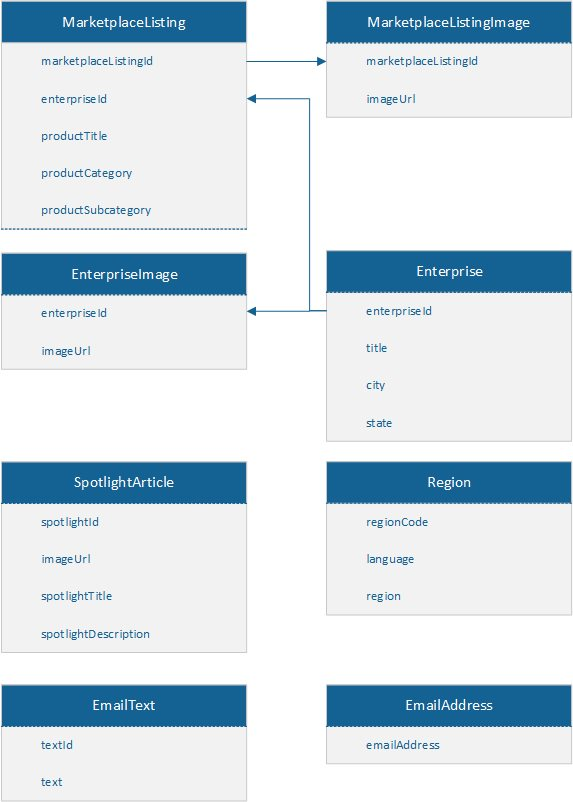

# Manage Newsletters at Good Market

## Architecture
### Newsletter API
The Newsletter API serves as an interface between the UI and the backend. 
#### Entities
Following entities are exposed.

The Newsletter API allows following operations on the entities.
| Entity | Operations |
|--- | --- |
| MarketplaceListing | GET, POST |
| MarketplaceListingImage | GET, POST |
| Enterprise | GET, POST | 
| EnterpriseImage | GET, POST |
| SpotlightArticle | GET, POST |
| Region | GET, POST |
| EmailText | GET, POST | 
| Region | GET, POST |
| EmailAddress |  (TODO: GET required?),  POST |
