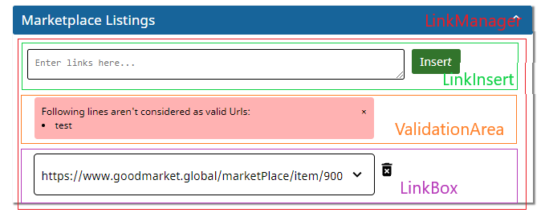

# LinkManager

[Source](../goodmarket-newsletter/src/components/LinkManager/LinkManager.js)

The LinkManager component has the following responsabilites:

- display, add and remove links
- create order in which links are presented (via drag&drop or arrows)

In the newsletter application LinkManager instances are used for spotlights, enterprise profiles and marketplace listings.

The LinkManager component uses the following subcomponents:



- LinkInsert: allows to insert links in a textbox and fetches content via button click
- LinkValidationArea: displays errors due to link validation or failed fetches
- LinkBox: displays inserted link and provides UI elements to change order and remove a link

The LinkManagerComponent needs to get state and update hook for the LinkBoxes as well as the fetch function and section parameter passed down from the parent component.
For implementation details see Docstrings in the code.

## Usage

```jsx
<LinkManager
    boxes={spotlights} // Link state for spotlights
    setBoxes={setSpotlights} // update hook for spotlights
    handleFetch={handleFetchSpotlight} // fetch function for spotlight links
    section={"spotlights"} // section parameter used to customzize appearance
/>
```

### LinkInsert subcomponent

The LinkInsert component provides a textfield to enter one or more links (separated by newlines) and a button to trigger fetching of links.
It needs text area state and update hook as well as a submit handler and a fetching state passed from the parent component.

#### Usage

```jsx
<LinkInsert
    textAreaContent={textAreaContent} // text area state
    handleChange={handleTextAreaChange} // update hook for text area
    handleSubmit={handleTextAreaSubmit} // submit handler
    fetchingData={fetchingData} // fetching state to display progress
/>
```

### LinkValidationArea subcomponent

The LinkValidationArea component is used to display errors that occured during the validation and fetching of links.
It gets it's content passed down from the parent state.

#### Usage

```jsx
<LinkValidationArea
    validationAreaContent={validationAreaContent} // content state for validaton area
    setValidationAreaContent={setValidationAreaContent} // update hook for content
/>
```

### LinkBox subcomponent

The LinkBox component is used to display single links. It offer control functionality to change the order via drag & drop and to remove links.
It needs handler functions for drag, drop, moving up, moving down and delete to be passed down by the parent component.

The rendering of the component is dependent on the section:
```jsx
switch (section) {
    case "spotlights": {
        ret = renderSpotlight();
        break;
    }
    case "enterprises": {
        ret = renderEnterprise();
        break;
    }
    case "marketplace listings": {
        ret = renderMarketplaceListing();
        break;
    }
    default: throw "invalid section in LinkBox: " + section;
}
```
See respective functions for the generated html.

#### Usage

```jsx
<LinkBox
    key={box.id} // key for react rerendering
    boxId={box.id} // needed for drag & drop
    box={box} // link structure with detail fields
    handleBoxContentChange={handleBoxContentChange} // handler for link detail changes
    section={section} // section parameter, controls rendering
    handleDrag={handleDrag} // drag handler
    handleDrop={handleDrop} // drop handler
    handleMoveUp={handleMoveUp} // handler for move up button
    handleMoveDown={handleMoveDown} // handler for move down button
    handleDelete={handleDelete} // handler for delete button
    upActive={box.order !== 1} // controls visability of up button, first item has no up button
    downActive={box.order !== boxes.length} // controls visability of up button, last item has no down button
/>
```