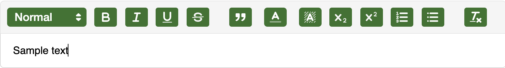
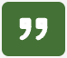
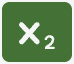
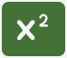
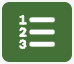
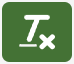

# TextBox

Our react component `TextBox` is based on the `react-quill` component (https://github.com/zenoamaro/react-quill) with the `snow` theme.

It displays an editor with a field to enter your text and with a header, that contains a menu to format the text.



### Menu options

In the menu you can format the selected text section with the following buttons and drop-downs:
*  font size
*  bold
*  italic
*  underline
*  strike through
*  block quote
*  text color
*  background color
*  subscript
*  superscript
*  numbered list
*  bullet points
*  insert link
*  clean all formatting

which are defined in `modules.toolbar` and `formats` in the code.

## Usage
The `TextBox` component
```jsx
<TextBox
    textBoxContent={sampleContent}
    handleChange={handleSampleChange}
/>
```
uses [state hooks](https://reactjs.org/docs/hooks-state.html), e.g. `sampleContent` and `handleSampleChange` with and empty default state:
```jsx
const [sampleContent, handleSampleChange] = useState("");
```

You can handover a state (`textBoxContent`) and a function that update the state (`handleChange`) to the `TextBox` component. `sampleContent` would contain the current state of the text box's text field, i.e. what the user is entering. It contains html tags, but they are rendered inside the text box's text field.

We use the `TextBox` to enter intro and outro text to the newsletter:
```jsx
<TextBox
    textBoxContent={introContent}
    handleChange={handleIntroChange}
/>
...
<TextBox
    textBoxContent={outroContent}
    handleChange={handleOutroChange}
/>
```
`introContent` and `outroContent` are then used in the `Preview Newsletter` section when we render the whole html newsletter including the links to the spotlights, enterprises and marketplace listings.